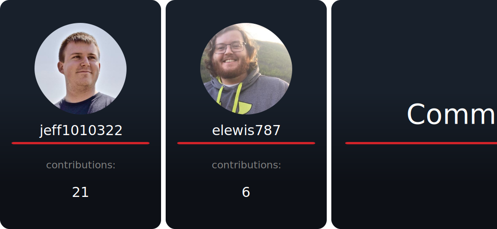

# Vaunt Cards Action

This action is used to generate Vaunt repository contribution cards.
It will make the API calls to Vaunt with optional authentication with a GitHub
[Personal Access Token](https://docs.github.com/en/authentication/keeping-your-account-and-data-secure/managing-your-personal-access-tokens)
and commit the images to the `.vaunt/cards` directory.

The GitHub PAT is used only to identify the user so no additional permissions are needed for users. For organizations
make sure to select Read access to members. See Vaunt docs [here](https://docs.vaunt.dev/guides/github/creating-a-pat)
for more details on creating the Personal Access Token.

## Example Workflow

Below is an example workflow that updates the Vaunt cards every hour.

```Yaml
name: Vaunt Cards Update
on:
  workflow_dispatch:
  schedule:
  - cron: 30 * * * *

jobs:
  my_job:
    runs-on: ubuntu-latest

    steps:
    - name: Checkout
      uses: actions/checkout@v3
    - name: Update Vaunt Cards
      uses: VauntDev/vaunt-cards-action@main
      with:
        # Github Personal Access Token for private repositories
        token: ${{ secrets.PAT }}
```

## Contributors

You can use the contributors card in your README by adding an image link like this:

```markdown

```


